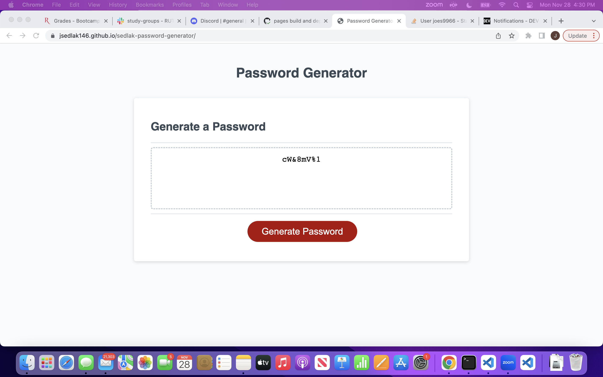

# sedlak-password-generator

## Description

For this challenge, we were asked to use JavaScript to create a functional randomized password generator.  This could be used for many security based applications, such as secure sites like mobile banking, or for employee log in information. Below are my URLs.

https://github.com/jsedlak146/sedlak-password-generator

https://jsedlak146.github.io/sedlak-password-generator/

## Installation

I started by pseudocodeing to get an idea of what I wanted to do and how to fulfill the requirements of the project.  I then designed a function to prompt the user to enter how long they wanted their password to be, and what character types they wanted to use.  If it was between 8-128 characters, it would move on and let them select their characters.  If not, they would be asked to choose a length within the acceptable range.
    After that was done, I had to enter all of the possible variables that could be used in a possible random password. Depending on whether the user chose if they wanted a certain character or letter type, I included conditionals to push out those letters. Finally, putting a loop designed to go through the choices and randomize them, but with the least possibility of accidentally missing anything. Once all of this was done, the password appears in the box.

## Usage

To use the password generator, start by clicking the "Generate Password" button.  You will then be prompted to select the length of your password, and the types of characters it contains.  If your password does not meet the necessary criteria, it will not be generated.  If it does meet criteria, your randomized password will appear in the box.

## Screenshot

## Licenses 

n/a

## Credits

n/a